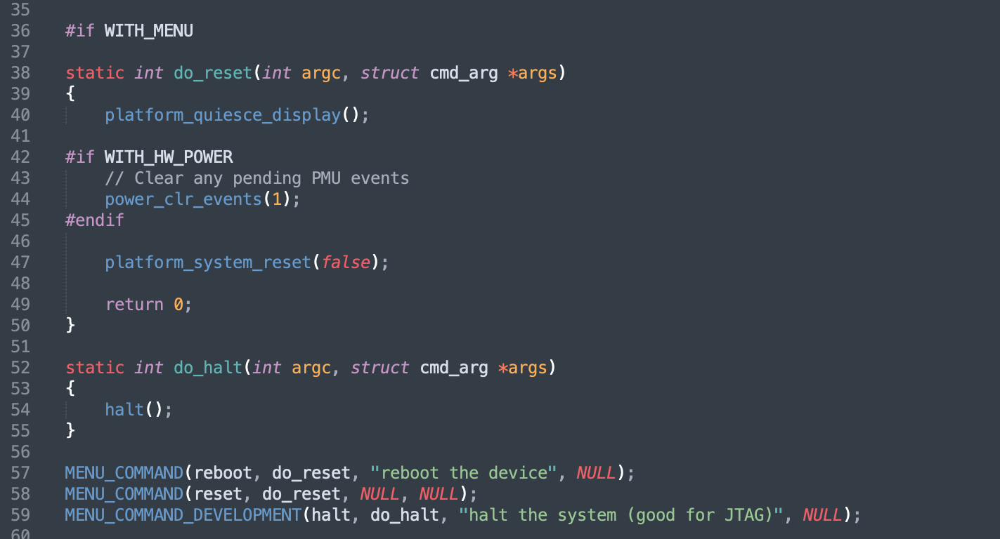
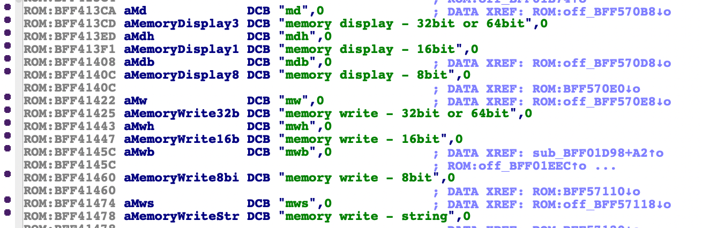
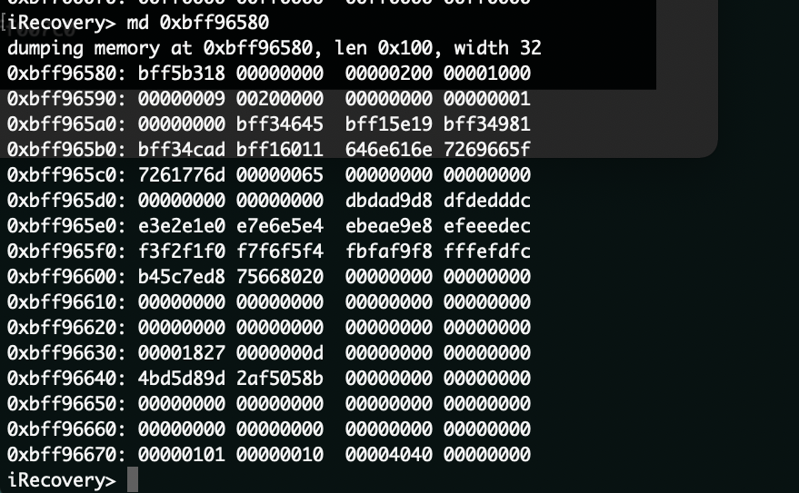
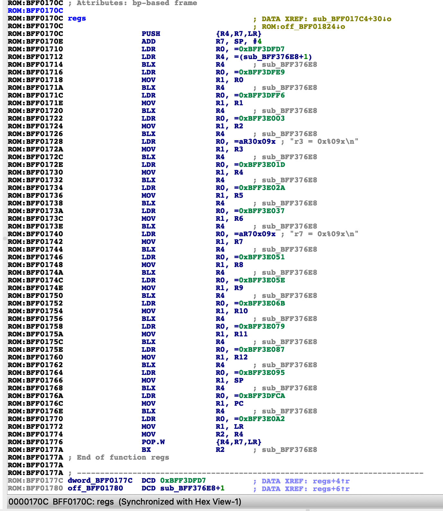

# environnement de Debug sur iBoot

DISCLAILMER!!! à noter que ce post les informations traitent en partie de logiciels et matériels internes à Apple, je ne serai pas en mesure de vous livrer quoi que ce soit. Ce post est à caractère éducatif et n'est en aucun cas un tutoriel. Notez également que jouer avec les parties bas niveaux de vos appareils peuvent causer des dommages irréversible, vous lisez ceci en connaissance de cause je ne serai résponsable pas résponsable.


iBoot comme vu dans l'article précédent, iBoot est la pièce maitresse du démarrage de nos appareils apple, il mets en place et s'occupe de bon nombre d'I/O (dont l'UART qui va nous être extremement utile ici).

Dans l'article précédent je vous ai montré l'utilisation de probes SWD afin de pouvoir debugger des appareils CPFM00/01 ou exploités avec Checkm8, l'idée ici est d'apporter des modifications à la bootchain afin de le rendre utile à une eventuelle recherche de vulnérabilités. Je vais donc vous expliquer comment j'ai pu obtenir des options supplémentaires dans le bootloader afin d'éviter d'avoir à acheter un de ces câbles magiques.


## premières explorations dans le code source

En 2018 un leaker a publié sur Github le code source (incomplet) d'iBoot iOS 9x (cf les différents articles sur internet), qui après certaines modifications dans le `Makefile` et à l'ajout d'units dans `la device_map.db` ont permit une compilation d'images DEVELOPMENT/DEBUG/RELEASE qui ont pu être booté grâce à kloader et checkm8.

Après quelques recherche dans le code j'ai commencé à cherché comment adapter les commandes iBoot DEBUG a une version DEVELOPMENT ou RELEASE au vu de la complexité de faire démarrer des images DEBUG.





ce qui est assez simple en remplaçant

```c
MENU_COMMAND_DEBUG()
```

par

```c
MENU_COMMAND() ou MENU_COMMAND_DEVELOPMENT
```

néanmoins cette methode est assez limité au vu de l'inutilité de la plupart des commandes, j'ai donc pensé par frustration à introduire les miennes.

Il est tout de même important de noter que les versions iBoot DEBUG, permettent d'écrire et de lire en memoire, néanmoins afin d'être démarrés elles nécessitent quelques modifications dans le code source.


Comme expliqué, dans les versions de debug sont assez étranges à faire fonctionner néanmoins elles integrent des commandes interessantes et ont des privilèges plus élevés par rapport aux versions RELEASE/DEVELOPMENT. 


Les commandes md/mw permettent de lire et d'écrire en memoire ce qui peut s'averer relativement pratique, en revanche elle ne fonctionnent nativement que sur ces verisons là, pour ce qui est des versions RELEASE/DEVELOPMENT il est nécessaire de modifier le code source.








### Modifications

Nativement le seul moyen d'obtenir l'état des registres CPU sur iBoot est de générer un paniclog en ajoutant un bp ou par tout autre moyen que j'expliquerai plus tard


le soucis etant que cela force un reboot de l'appareil donc utile mais pas dans l'idée. J'ai donc cherché à pouvoir afficher l'etat des registres sans avoir à reboot et ce par entré d'une commande.


```c
static int do_regs(int argc, struct cmd_arg *args)
{

	printf("\narm registers:\n\n");
 int address = 0;
 __asm__("mov %0, r0\n\t" : "=r" (address));
 printf("r0 = 0x%09x\n", address);

 //same for r1, r2, r3, r4, r5.....etc
}
MENU_COMMAND(regs, do_regs, "print registers addresses", NULL);
```


j'ai donc effectué la même opperation pour tout les registres afin de pouvoir obtenir l'adresse de chacuns des registres grace à `__asm__(`) et de l'afficher via `Printf()`.

J'ai donc utilisé `MENU_COMMAND()`afin d'intégrer la commande aux trois types d'images. (à noter que sur un iBoot RELEASE un cable UART est indispensable et des patch supplémentaires doivent être appliqué).
Dans les versions non compilées il est possible d'intégrer ces differentes fonctions grâce a un payload fait avec iBEX.





