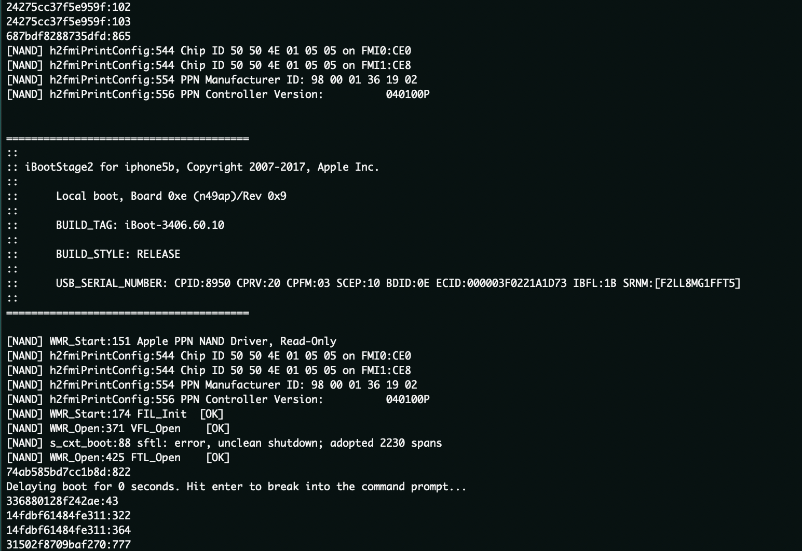
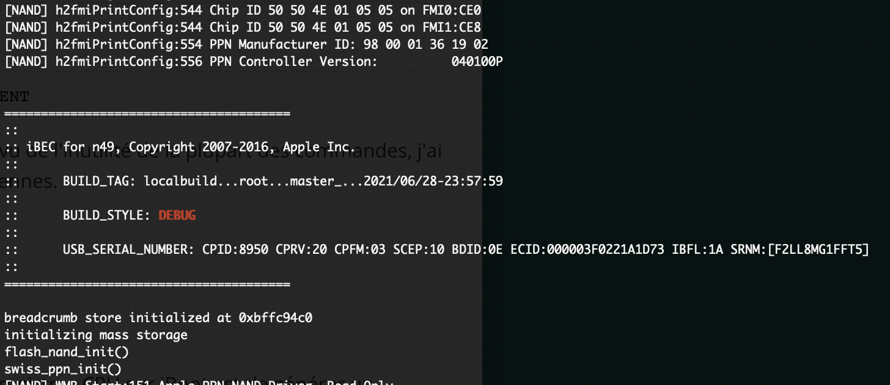
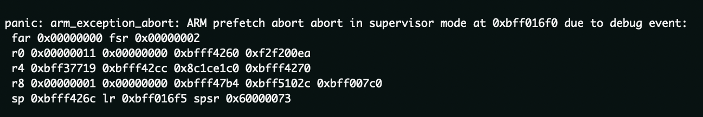
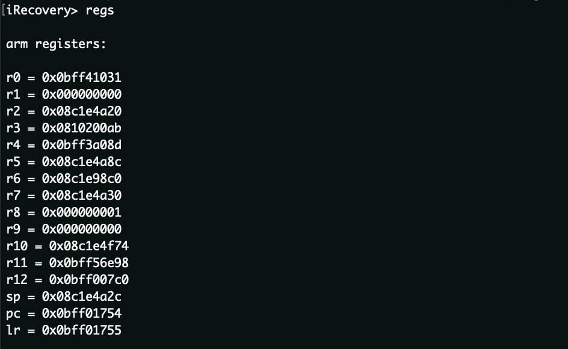

# environnement de Debug sur iBoot

DISCLAILMER!!! à noter que ce post les informations traitent en partie de logiciels et matériels internes à Apple, je ne serai pas en mesure de vous livrer quoi que ce soit. Ce post est à caractère éducatif et n'est en aucun cas un tutoriel. Notez également que jouer avec les parties bas niveaux de vos appareils peuvent causer des dommages irréversible, vous lisez ceci en connaissance de cause je ne serai pas responsable.





iBoot comme vu dans l'article précédent, est la pièce maitresse du démarrage de nos appareils apple, tout du moins la plus importante, il met en place et s'occupe de bon nombre d'I/O comme l'USB ou l'UART (qui vont nous être extremement utiles ici). Notez que depuis quelques années il n'y à plus qu'un seul Bootloader dans nos iPhones.

Précédement, je vous avait montré l'utilisation de probes SWD afin de pouvoir debugger le SoC et l'iBoot des appareils CPFM00/01 ou exploités avec Checkm8, l'idée ici est d'apporter des modifications à iBoot afin de le rendre plus utile à une éventuelle recherche de vulnérabilités ou une meilleure appréhension de celui-ci. Je vais donc vous expliquer comment j'ai pu obtenir des options supplémentaires dans le bootloader en y ajoutant mes propres fonctions afin d'éviter d'avoir à acheter un de ces câbles magiques.


## premières explorations dans le code source

En 2018 un leaker a publié sur Github le code source (incomplet) d'iBoot iOS 9x (cf les différents articles sur internet), qui après certaines modifications dans le `Makefile` et à l'ajout d'units dans `la device_map.db` et autres petits tricks ont permit une compilation d'images DEVELOPMENT/DEBUG/RELEASE qui ont pu être booté grâce à kloader et checkm8.

Après quelques recherches dans le code j'ai commencé à chercher comment adapter les commandes iBoot DEBUG à une version DEVELOPMENT ou RELEASE au vu de la complexité de faire démarrer des images DEBUG.

l'idée est dans cette portion de code:


```c
#if WITH_MENU

static int do_reset(int argc, struct cmd_arg *args)
{
	platform_quiesce_display();

#if WITH_HW_POWER
	// Clear any pending PMU events
	power_clr_events(1);
#endif

	platform_system_reset(false);

	return 0;
}

static int do_halt(int argc, struct cmd_arg *args)
{
	halt();
}

MENU_COMMAND(reboot, do_reset, "reboot the device", NULL);
MENU_COMMAND(reset, do_reset, NULL, NULL);
MENU_COMMAND_DEVELOPMENT(halt, do_halt, "halt the system (good for JTAG)", NULL);
```


Ce qui est assez simple en remplaçant

```c
MENU_COMMAND_DEBUG()
```

par

`MENU_COMMAND()` ou `MENU_COMMAND_DEVELOPMENT()`


Néanmoins il est important de savoir que cette méthode est assez limité au vu de l'inutilité de la plupart des commandes qui hors des versions de DEBUG (ou appareils proto), ne fonctionnenent tout simplement pas (certaines sont désactivées dans le code).
Notez que les versions iBoot DEBUG permettent d'écrire et de lire en memoire. Néanmoins afin d'être démarrées elles nécessitent quelques modifications que je n'expliquerai pas ici.





Les versions de debug intègrent des commandes intéressantes et ont des privilèges plus élevés par rapport aux versions RELEASE/DEVELOPMENT. 
Les commandes md/mw par exemple permettent de lire et d'écrire en mémoire ce qui peut s'avérer relativement pratique.
En revanche elle ne fonctionnent nativement que sur les images DEBUG. Pour ce qui est des versions RELEASE/DEVELOPMENT, il est nécessaire d'apporter des patchs supplémentaires.
La commande `md` `<addr>` permet donc d'afficher un dump de memoire a une addresse donnée:

```c
static int
do_memdump(int argc, struct cmd_arg *args)
{
	uintptr_t address;
	size_t count;
	int width;
	size_t i;
	int index_mod = 16;

	/* default dump values */
	static uintptr_t last_address = DEFAULT_LOAD_ADDRESS;
	static size_t last_count = 0x100;

	if (!strcmp(args[0].str, "md")) {
		width = 32;
		if (argc > 1) {
			if (!strcmp(args[1].str, "-help")) {
				memdump_usage();
				return 0;
			} else if (!strcmp(args[1].str, "-64")) {
				width = 64;
				index_mod = 32;
			}
		}
	} else if (!strcmp(args[0].str, "mdh")) {
		width = 16;
	} else {
		width = 8;
	}
```
la structure est celle d'une commande basique d'iBoot, si la commande est entrée elle print un dump 32bits d'une addresse de base, mais ont peut spécifier `-64` derrière.
La commande `mw` permet à l'inverse d'écrire en memoire à peut près tout ce que vous voulez.


### Modifications


Nativement le seul moyen d'obtenir l'état des registres CPU sur iBoot est de générer un paniclog en ajoutant un bp ou par tout autre moyen que j'expliquerai plus tard




le soucis etant que cela force un reboot de l'appareil donc utile mais pas dans l'idée. J'ai donc cherché à pouvoir afficher l'etat des registres sans avoir à reboot et ce par entré d'une commande.


```c
static int do_regs(int argc, struct cmd_arg *args)
{

	printf("\narm registers:\n\n");
 int address = 0;
 __asm__("mov %0, r0\n\t" : "=r" (address));
 printf("r0 = 0x%09x\n", address);

 //same for r1, r2, r3, r4, r5.....etc
}
MENU_COMMAND(regs, do_regs, "print registers addresses", NULL);
```


j'ai donc effectué la même opperation pour tout les registres afin de pouvoir obtenir l'adresse de chacuns des registres grace à `__asm__(`) et de l'afficher via `Printf()`.

J'ai donc utilisé `MENU_COMMAND()`afin d'intégrer la commande aux trois types d'images. (A noter que sur un iBoot RELEASE un cable UART est indispensable et des patch supplémentaires doivent être appliqué).
Dans les versions non compilées, il est possible d'intégrer ces differentes fonctions grâce à un payload fait avec iBEX de Xerub (je m'expliquerai un peu plus loin).

Comme vous pouvez le voir lorsque je rentre la commande regs la console iRecovery me retourne la valeur de chacuns des registres (c'est également affiché dans le UART log).




