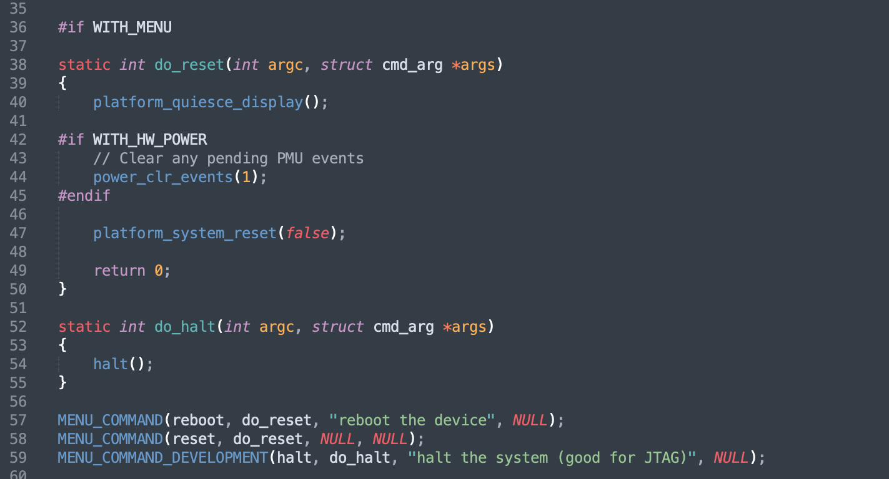
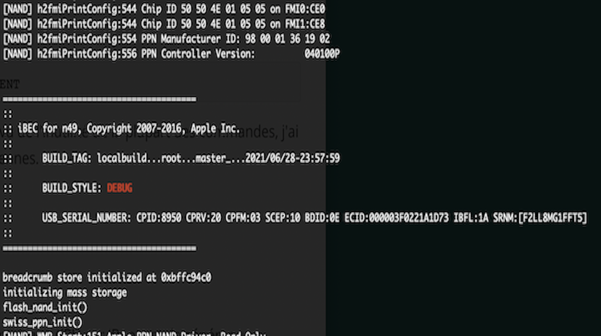
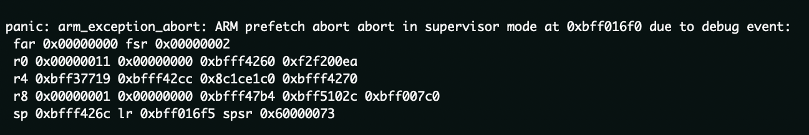
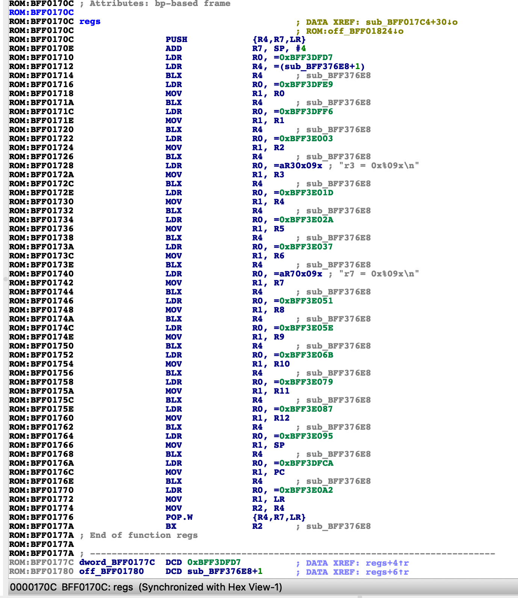
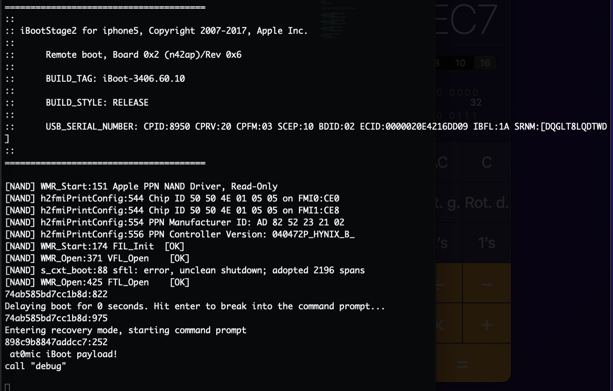
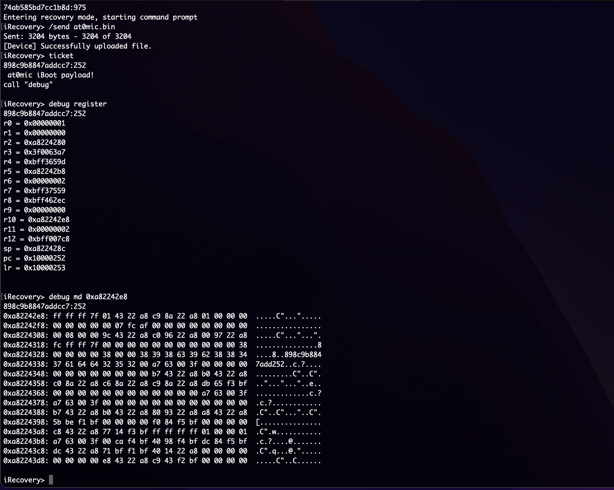
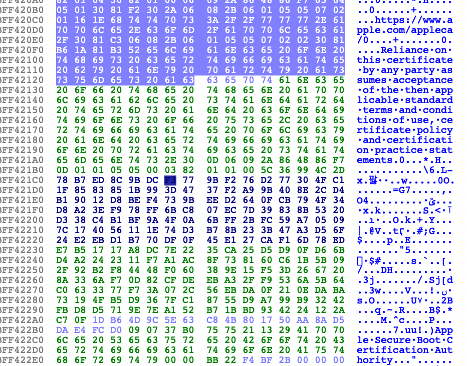

# environnement de Debug sur iBoot


iBoot comme vu dans l'article précédent, iBoot est la piece maitresse du démarrage de nos appareils apple, il mets en place et s'occupe de bon nombre d'I/O (dont l'UART qui va nous etre extremement utilie ici).

Dans l'article précédent je vous ai montré l'utilisation de probes SWD afin de pouvoir debugger des appareils CPFM00/01 ou exploités avec Checkm8, l'idée ici est d'apporter des modifications à la bootchain afin de la rendre plus utilie à une eventuelle recherche de vulnérabilités. Je vais donc vous expliquer comment j'ai pu obtenir des options supplémentaires dans le bootloader afin d'éviter d'avoir à trouver un de ces câbles magiques.


## premières explorations dans le code source

En 2018 un leaker a publié sur Github le code source (incomplet) d'iBoot iOS 9x, qui après certaines modifications à permis une compilation d'image DEVELOPMENT/DEBUG/RELEASE qui ont pu être booté grâce a kloader et checkm8.

Après quelques recherche dans le code j'ai cherché à adapter les commandes iBoot DEBUG a une version DEVELOPMENT ou RELEASE au vu de la complexité de faire démarrer des images DEBUG.





ce qui est assez simple en remplaçant

```c
MENU_COMMAND_DEBUG()
```

par

```c
MENU_COMMAND() ou MENU_COMMAND_DEVELOPMENT
```

néanmoins cette methode est assez limité au vu de l'inutilité de la plupart des commandes, j'ai donc pensé par frustration à introduire les miennes.

Il est tout de même important de noter que les versions iBoot DEBUG, permettent d'écrire et de lire en memoire, néanmoins afin d'être démarrés elles nécessitent quelques modifications dans le code source.





Comme expliqué, dans les versions de debug sont assez étranges à faire fonctionner néanmoins elles integrent des commandes interessantes et ont des privilèges plus élevés par rapport aux versions RELEASE/DEVELOPMENT. 


Les commandes md/mw permettent de lire et d'écrire en memoire ce qui peut s'averer relativement pratique, en revanche elle ne fonctionnent nativement que sur ces verisons là, pour ce qui est des versions RELEASE/DEVELOPMENT il est nécessaire de modifier le code source.


### Modifications

Nativement le seul moyen d'obtenir l'état des registres CPU sur iBoot est de générer un paniclog en ajoutant un bp ou par tout autre moyen que j'expliquerai plus tard





le soucis etant que cela force un reboot de l'appareil donc utile mais pas dans l'idée. J'ai donc cherché à pouvoir afficher l'etat des registres sans avoir à reboot et ce par entré d'une commande.


```c
static int do_regs(int argc, struct cmd_arg *args)
{

	printf("\narm registers:\n\n");
 int address = 0;
 __asm__("mov %0, r0\n\t" : "=r" (address));
 printf("r0 = 0x%09x\n", address);

 //same for r1, r2, r3, r4, r5.....etc
}
MENU_COMMAND(regs, do_regs, "print registers addresses", NULL);
```


j'ai donc effectué la même opperation pour tout les registres afin de pouvoir obtenir l'adresse de chacuns des registres grace à `__asm__(`) et de l'afficher via `Printf()`.

J'ai donc utilisé `MENU_COMMAND()`afin d'intégrer la commande aux trois types d'images. (à noter que sur un iBoot RELEASE un cable UART est indispensable sans patch supplémentaires).





## les payloads...


Certes les modifications du code source de l'iBoot que nous avons vu précédement sont grandement intéressantes dans un but d'une meilleure compréhesion du boot process des iPhones. En revanche, sans accès à ce SRC ou dans le cas d'un iBoot iOS 10+ ou Aarch64, la meilleure option est à mon sens un payload.

Il est possible d'avoir une base déja prête grâce à iBEX (@xerub) ou StarInjector (@Nyan_satan) qui ont chacun le second est basé sur le premier. (Je vous mettrais les liens vers les deux repos Git)

Il est tout de même nécessaire d'avoir un iBoot/iBEC patché (Je conseille un iBEC au vu de la simplicité de mise en place par rapport à un iBoot mais je vais y revenir.)





Pour lancer un payload dans la console recovery de iBEC, il est necessaire de le patcher afin de supprimer les vérifications de signatures (iBoot32patcher @iH8sn0w), ainsi que d'ajouter un pointeur vers une commande pour charger l'adresse à laquelle sera chargé le payload (les commandes ticket ou go par exemple) 


`iboot32patcher iBEC.iphone5.RELEASE.dfu. iBECpatch -c ticket 0x80000000`


Après avoir patché le bootloader il suffit de le replacer dans un conteneur img3 grâce à `image3maker` et de l'envoyer via `iRecovery` après avoir chargé un iBSS patché en pwndfu checkm8.

Il n'y a plus qu'à envoyer le payload et de de l'éxecuter via la commande `ticket`. Le payload est donc actif, il suffit maintenant d'envoyer des commandes ajoutées après le prefix `debug` que j'ai assigné (c'est un exemple vous pouvez ajouter ce que vous voulez dans le code, c'est personnel).

 




Comme vous pouvez le voir, j'ai ajouté les commandes `md` (dejà présente dans les versions DEBUG), mais également la commande register que j'avais créé dans le src d'iBoot.

j'ai également implémenté `mw`  de cette manière (en partie) :


```c
#define GETREG32(addr) (*((unsigned int*) addr))
#define SETREG32(addr, val) (*(volatile unsigned int*) addr = val)


int do_mw(int argc, struct cmd_arg *args) {
  
  if(argc != 3) {
    printf("usage: mw <address> <value>\n");
    return 0;
}

unsigned int address = args[1].u;
unsigned int value = args[2].u;
SETREG32(address, value);
//clear_cpu_caches();
return 0;
}

MENU_COMMAND("mw", do_mw, "memory write 32bit")`
```

La commande est implémenté de manière différente que dans le code d'Apple, mais l'usage est le même. J'ai également implémenté une commanque qui permet de modifier les registres ARM (pc = 0x41414141 ou n'importe quel registre afin de générer des panic dumps)

Sur la notion de payload sur arm32, il n'y a en soit pas vraiment de limite vous pouvez y intégrer à peut près tout ce qui peut vous être utile. J'ai bien personnalisé le miens, je le publierai sur GitHub quand il sera complètement prêt.


## Ajouter du code directement dans iBoot...


Comme je l'ai expliqué dans les sections précédentes, il est également possible d'ajouter des fonctions particulière (debug, print la stack et autres...) directement dans un iBoot récupéré dans un fichier IPSW.

En effet comme me l'avait expliqué iH8sn0w il y a quelques années lorsque je lui avait expliqué mon idée d'ajouter des fonctions supplémentaires dans iBoot à des fins de recherche, qu'il était possible de placer un payload dans iBoot au niveau du Apple Root Certificate.

une fois le bootlader patché il suffit d'ajouter un pointeur vers le dit payload afin de pouvoir l'executer au boot





l'intérêt de cette méthode est que l'accès à iBoot est direct en revanche elle permet l'integration de bien moins de fonctions dans le bootloader, elle est plus utile comme vecteur d'exploitation (cf @JonathanSeals).


